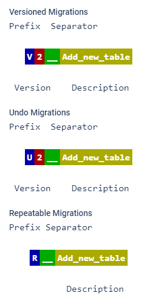

## Тестовый проект для демонстрации возможностей Spring Boot + Flyway

Flyway - это инструмент для управления миграциями базы данных, который позволяет автоматизировать 
процесс создания и обновления базы данных. Flyway позволяет создавать сценарии миграции, которые 
могут быть выполнены на различных платформах и базах данных. Он также предоставляет возможность 
отслеживать изменения в базе данных и управлять версиями миграций.

Каждое изменение в БД должно сопровождаться **созданием нового файла** с расширением .sql по установленному 
образцу.

### Конвенция об именовании

Для того чтобы быть подхваченными Flyway, миграции на Java должны реализовывать интерфейс `JavaMigration`. 
Однако большинству пользователей лучше наследоваться от удобного класса `BaseJavaMigration`, поскольку 
он поддерживает стандартное соглашение Flyway об именовании, позволяя Flyway автоматически извлекать 
версию и описание из имени класса. Для этого имя класса должно соответствовать следующему шаблону 
именования:

**Имя класса состоит из следующих частей:**
- Префикс: `V` для версионных миграций, `U` для отмены миграций, `R` для повторяемых миграций
- Версия: символы подчеркивания (автоматически заменяемые точками во время выполнения) разделяют любое количество частей (не для повторяющихся миграций)
- Разделитель: `__` (два подчеркивания)
- Описание: Подчеркивания (автоматически заменяемые пробелами во время выполнения) разделяют слова

### Источники:
- [JR - SpringBoot + Flyway - 2021-01-13](https://javarush.com/groups/posts/3157-java-proekt-ot-a-do-ja-springboot--flyway)
- [Habr - Миграции баз данных с Flyway - 2020-06-15](https://habr.com/ru/companies/otus/articles/506788)
- [Flyway документация - 2023-07-27](https://documentation.red-gate.com/flyway/flyway-cli-and-api/concepts/migrations)

